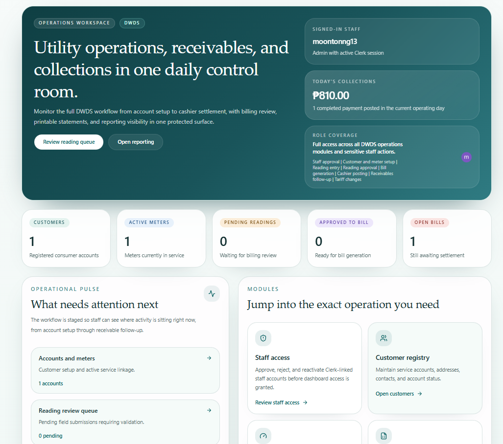
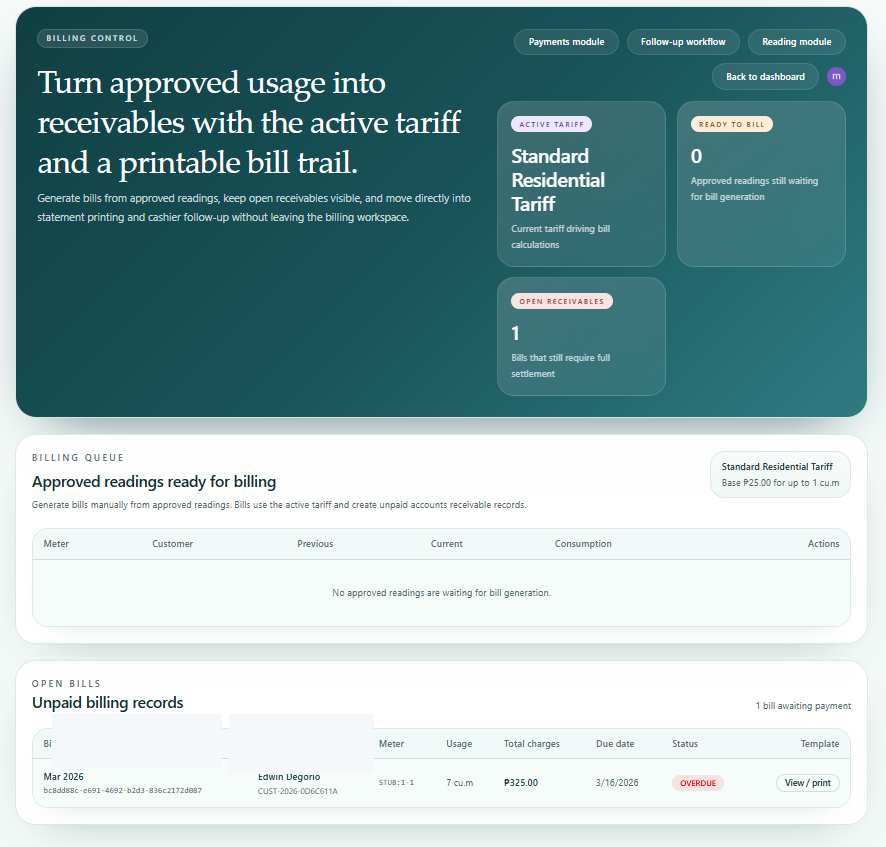
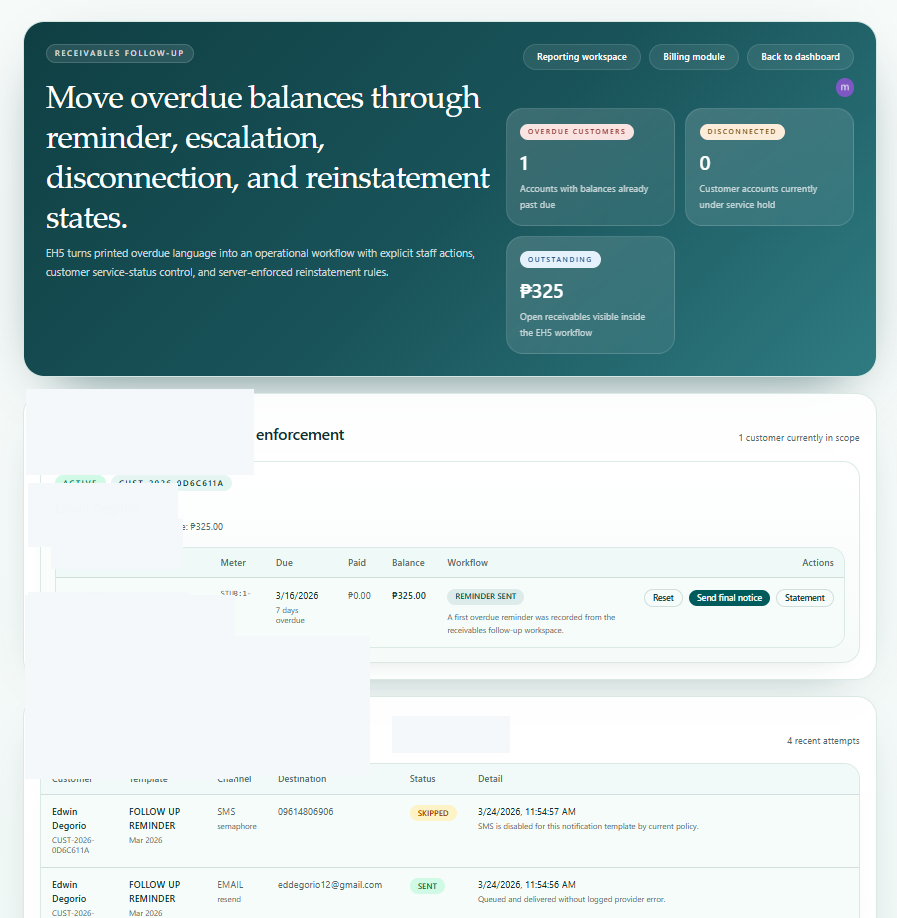

# DESWATERS

DESWATERS is the repository for the `DEGORIO WATER DISTRIBUTION SERVICES` web platform.

The current implemented application lives in [`v1/`](./v1).

## Current Release Scope

The live product surface is the staff-facing utility operations system plus a public marketing site.

Implemented now:
- staff sign-in and approval-gated admin access
- customer, meter, tariff, reading, billing, payment, and collections workflows
- overdue follow-up tracking with notification logging
- public-facing marketing pages

Not implemented yet:
- consumer self-service portal
- online customer payments
- public customer-facing account access

## Screenshots

Current repository screenshots are real product captures with sensitive fields redacted for public sharing.

### Operations Dashboard

### Billing Review

### Receivables Follow-Up

## Project Location

The active Next.js application is inside [`v1/`](./v1).

Important files:
- app documentation: [`v1/README.md`](./v1/README.md)
- screenshot workflow: [`v1/docs/github-screenshots.md`](./v1/docs/github-screenshots.md)
- app source: [`v1/src/`](./v1/src)
- Prisma schema: [`v1/prisma/schema.prisma`](./v1/prisma/schema.prisma)
- deployment workflow: [`v1/.github/workflows/ci.yml`](./v1/.github/workflows/ci.yml)

## Deployment Notes

If you deploy this repository on Vercel, set the project root directory to `v1`.

The current deployment target is the staff/admin app and marketing site, not the consumer portal.

## License

This repository is proprietary. See [`LICENSE`](./LICENSE).
